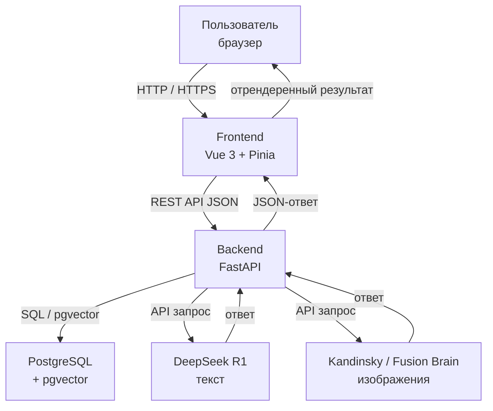

# Архитектура платформы интерактивного формирования запросов

```mermaid
graph TD
    %% --- Клиент ---
    user[Пользователь<br/>браузер]

    %% --- Frontend ---
    fe[Frontend<br/>Vue 3 + Pinia]

    %% --- Backend и БД ---
    be[Backend<br/>FastAPI]
    db[PostgreSQL<br/>+ pgvector]

    %% --- Внешние AI-сервисы ---
    deep[DeepSeek R1<br/>текст]
    kdn[Kandinsky / Fusion Brain<br/>изображения]

    %% --- Потоки данных ---
    user -- "HTTP / HTTPS" --> fe
    fe   -- "REST API JSON" --> be
    be   -- "SQL / pgvector" --> db

    %% Вызовы внешних сервисов
    be -- "API запрос" --> deep
    be -- "API запрос" --> kdn
    deep -- "ответ" --> be
    kdn  -- "ответ" --> be

    %% Ответ обратно пользователю
    be -- "JSON-ответ" --> fe
    fe -- "отрендеренный результат" --> user
```
