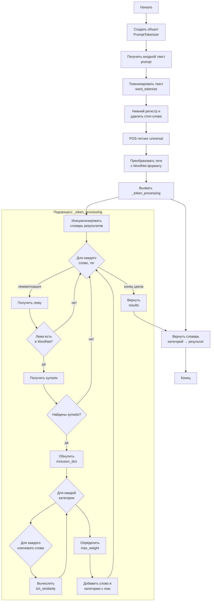

# Rating algo

```mermaid
flowchart TD
    %% --- Основной поток ---
    A[Начало] --> B[Создать объект <br/>PromptTokenizer]
    B --> C[Получить входной текст<br/>prompt]
    C --> D[Токенизировать текст<br/>word_tokenize]
    D --> E[Нижний регистр и<br/>удалить стоп-слова]
    E --> F[POS-теггинг universal]
    F --> G[Преобразовать теги<br/>к WordNet-формату]
    G --> H[Вызвать _token_processing]
    H --> Z[Вернуть словарь<br/>категорий → результат]
    Z --> Y[Конец]

    %% --- Подпроцесс _token_processing ---
    subgraph Подпроцесс _token_processing
        direction TB
        P1[Инициализировать<br/>словарь результатов] --> P2{Для каждого<br/>слово, тег}
        P2 -->|лемматизация| P3[Получить лему]
        P3 --> P4{Лема есть<br/>в WordNet?}
        P4 -->|нет| P2
        P4 -->|да| P5[Получить synsets]
        P5 --> P6{Найдены synsets?}
        P6 -->|нет| P2
        P6 -->|да| P7[Обнулить<br/>inclusion_dict]
        P7 --> P8{Для каждой<br/>категории}
        P8 --> P9{Для каждого<br/>ключевого слова}
        P9 --> P10[Вычислить<br/>lch_similarity]
        P10 --> P8
        P8 --> P11[Определить<br/>max_weight]
        P11 --> P12[Добавить слово в<br/>категорию с max]
        P12 --> P2
        P2 -->|конец цикла| P13[Вернуть<br/>results]
    end

    %% --- Связь основного потока и подпроцесса ---
    H --> P1
    P13 --> Z
```
